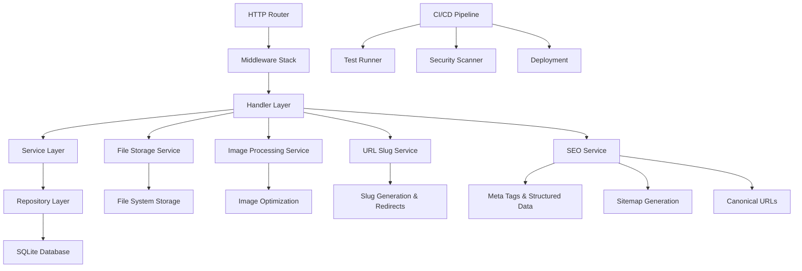

# Design Document

## Overview

This design enhances the existing Go blog platform with comprehensive testing, CI/CD automation, security updates, SEO-friendly URLs with canonical URL support, comprehensive SEO optimization, and media management capabilities. The solution also removes the courses and links sections to focus solely on blog content. The solution maintains the current SQLite-based architecture while adding new features through modular components.

## Architecture

### Current Architecture Analysis
- **Framework**: Native Go net/http with custom routing
- **Database**: SQLite with manual SQL queries
- **Authentication**: Session-based with GitHub OAuth integration
- **Templates**: Go html/template system
- **Static Files**: Direct file serving from public/ directory

### Enhanced Architecture Components



## Components and Interfaces

### 1. Testing Infrastructure

**Test Coverage Enhancement**
- Unit tests for all handlers, models, and utility functions
- Integration tests for database operations
- HTTP endpoint testing with proper mocking
- Test utilities for database setup/teardown

**Test Structure**
```go
// Test categories
- Handler tests (app/*_test.go)
- Model tests (model/*_test.go) 
- Service tests (services/*_test.go)
- Integration tests (tests/integration/*_test.go)
```

### 2. CI/CD Pipeline

**GitHub Actions Workflow**
- Automated testing on pull requests
- Go version matrix testing
- Code coverage reporting
- Security vulnerability scanning
- Automated dependency updates

### 3. URL Slug System

**Slug Generation Service**
```go
type SlugService interface {
    GenerateSlug(title string) string
    EnsureUniqueSlug(slug string, postID int) string
    GetPostBySlug(slug string) (*Post, error)
}
```

**URL Migration Strategy**
- Add `slug` column to posts table
- Generate slugs for existing posts
- Implement redirect middleware for old URLs
- Update all internal links to use slugs

### 4. File Management System

**File Storage Service**
```go
type FileService interface {
    UploadFile(file multipart.File, filename string) (*FileInfo, error)
    GetFile(fileID string) (*FileInfo, error)
    DeleteFile(fileID string) error
    ListFiles(userID string) ([]*FileInfo, error)
}

type FileInfo struct {
    ID          string
    OriginalName string
    StoredName   string
    Size        int64
    MimeType    string
    UploadedAt  time.Time
    DownloadCount int
}
```

**Storage Structure**
```
uploads/
└── files/
    ├── 2024/01/
    │   ├── documents/     # Non-image files
    │   ├── images/        # Original images
    │   └── thumbnails/    # Generated thumbnails
    └── 2024/02/
        ├── documents/
        ├── images/
        └── thumbnails/
```

### 5. Extended File System with Image Processing

**Enhanced File Service with Image Support**
```go
type FileService interface {
    UploadFile(file multipart.File, filename string) (*FileInfo, error)
    UploadImage(file multipart.File, filename string) (*FileInfo, error) // Extended for images
    GetFile(fileID string) (*FileInfo, error)
    DeleteFile(fileID string) error
    ListFiles(userID string) ([]*FileInfo, error)
    IsImageFile(mimeType string) bool
    ProcessImage(fileInfo *FileInfo) error
    GenerateThumbnail(fileInfo *FileInfo) error
}

type FileInfo struct {
    ID            string
    OriginalName  string
    StoredName    string
    Size          int64
    MimeType      string
    UploadedAt    time.Time
    DownloadCount int
    // Image-specific fields (populated when IsImage = true)
    IsImage       bool
    Width         int
    Height        int
    ThumbnailPath string
    AltText       string
}
```

**Image Processing Features**
- Automatic image detection and processing within file upload flow
- Thumbnail generation for image files (300x300 for previews)
- Image optimization without quality loss
- Automatic insertion of image references into post content during upload

### 6. SEO Optimization System

**SEO Service Interface**
```go
type SEOService interface {
    GenerateMetaTags(post *Post) map[string]string
    GenerateStructuredData(post *Post) string
    GenerateOpenGraphTags(post *Post) map[string]string
    GenerateSitemap(posts []*Post) ([]byte, error)
    GenerateRobotsTxt() string
    GetCanonicalURL(post *Post) string
}
```

**SEO Components**
- Meta tag generation (title, description, keywords)
- JSON-LD structured data for blog posts
- Open Graph tags for social media sharing
- Sitemap.xml generation with canonical URLs
- Robots.txt configuration
- Canonical URL management to prevent duplicate content

### 7. Content Removal System

**Courses and Links Removal**
- Remove courses and links handlers from routing
- Remove courses and links templates
- Remove courses and links data files
- Update navigation to exclude removed sections
- Return 404 for legacy courses/links URLs

## Data Models

### Enhanced Post Model
```go
type Post struct {
    ID          int       `json:"id"`
    Title       string    `json:"title"`
    Slug        string    `json:"slug"`        // New field
    Body        string    `json:"body"`
    Date        string    `json:"date"`
    CreatedAt   time.Time `json:"created_at"`  // New field
    UpdatedAt   time.Time `json:"updated_at"`  // New field
    // SEO fields
    MetaDescription string `json:"meta_description,omitempty"`
    Keywords        string `json:"keywords,omitempty"`
}
```

### SEO Metadata Model
```go
type SEOData struct {
    Title           string            `json:"title"`
    Description     string            `json:"description"`
    Keywords        []string          `json:"keywords"`
    CanonicalURL    string            `json:"canonical_url"`
    OpenGraphTags   map[string]string `json:"og_tags"`
    StructuredData  string            `json:"structured_data"`
}
```

### File Model
```go
type File struct {
    ID            int       `json:"id"`
    UUID          string    `json:"uuid"`
    OriginalName  string    `json:"original_name"`
    StoredName    string    `json:"stored_name"`
    Path          string    `json:"path"`
    Size          int64     `json:"size"`
    MimeType      string    `json:"mime_type"`
    DownloadCount int       `json:"download_count"`
    CreatedAt     time.Time `json:"created_at"`
}
```

### Enhanced File Model (Unified for Files and Images)
```go
type File struct {
    ID            int       `json:"id"`
    UUID          string    `json:"uuid"`
    OriginalName  string    `json:"original_name"`
    StoredName    string    `json:"stored_name"`
    Path          string    `json:"path"`
    Size          int64     `json:"size"`
    MimeType      string    `json:"mime_type"`
    DownloadCount int       `json:"download_count"`
    CreatedAt     time.Time `json:"created_at"`
    // Image-specific fields (NULL for non-images)
    IsImage       bool      `json:"is_image"`
    Width         *int      `json:"width,omitempty"`
    Height        *int      `json:"height,omitempty"`
    ThumbnailPath *string   `json:"thumbnail_path,omitempty"`
    AltText       *string   `json:"alt_text,omitempty"`
}
```

### Database Schema Updates
```sql
-- Add slug column to existing posts table
ALTER TABLE posts ADD COLUMN slug TEXT UNIQUE;
ALTER TABLE posts ADD COLUMN created_at DATETIME DEFAULT CURRENT_TIMESTAMP;
ALTER TABLE posts ADD COLUMN updated_at DATETIME DEFAULT CURRENT_TIMESTAMP;
ALTER TABLE posts ADD COLUMN meta_description TEXT;
ALTER TABLE posts ADD COLUMN keywords TEXT;

-- Create files table
CREATE TABLE files (
    id INTEGER PRIMARY KEY AUTOINCREMENT,
    uuid TEXT UNIQUE NOT NULL,
    original_name TEXT NOT NULL,
    stored_name TEXT NOT NULL,
    path TEXT NOT NULL,
    size INTEGER NOT NULL,
    mime_type TEXT NOT NULL,
    download_count INTEGER DEFAULT 0,
    created_at DATETIME DEFAULT CURRENT_TIMESTAMP
);

-- Extend files table to support images
ALTER TABLE files ADD COLUMN is_image BOOLEAN DEFAULT FALSE;
ALTER TABLE files ADD COLUMN width INTEGER;
ALTER TABLE files ADD COLUMN height INTEGER;
ALTER TABLE files ADD COLUMN thumbnail_path TEXT;
ALTER TABLE files ADD COLUMN alt_text TEXT;
```

## Error Handling

### Structured Error Response
```go
type APIError struct {
    Code    int    `json:"code"`
    Message string `json:"message"`
    Details string `json:"details,omitempty"`
}
```

### Error Categories
- **Validation Errors**: Invalid input data (400)
- **Authentication Errors**: Unauthorized access (401)
- **Authorization Errors**: Insufficient permissions (403)
- **Not Found Errors**: Resource not found (404)
- **File Errors**: Upload/processing failures (422)
- **Server Errors**: Internal processing errors (500)

### File Upload Error Handling
- File size limits (configurable, default 10MB for files, 5MB for images)
- MIME type validation with automatic image detection
- Storage space checks
- Image processing failures (thumbnail generation, optimization)
- Malicious file detection
- Automatic post content insertion failures

## Testing Strategy

### Unit Testing
- **Coverage Target**: 80% minimum
- **Test Categories**:
  - Handler functions with mocked dependencies
  - Model methods with test database
  - Service layer business logic
  - Utility functions and helpers

### Integration Testing
- Database operations with real SQLite instance
- File upload and processing workflows
- Authentication and authorization flows
- URL slug generation and redirect logic

### End-to-End Testing
- Complete user workflows (create post, upload image, etc.)
- Cross-browser compatibility for file uploads
- Performance testing for image processing

### Test Database Strategy
- Separate test database for each test suite
- Database migrations testing
- Data seeding for consistent test scenarios
- Cleanup procedures for test isolation

## Security Considerations

### Dependency Updates
- Update all vulnerable packages identified in go.mod
- Implement automated dependency scanning
- Regular security audit schedule

### File Upload Security
- MIME type validation and file signature checking
- File size limits and storage quotas
- Virus scanning for uploaded files
- Secure file naming to prevent path traversal
- Content-Security-Policy headers for image serving

### URL Security
- Slug validation to prevent XSS
- Proper URL encoding and sanitization
- Rate limiting for slug generation
- Redirect validation to prevent open redirects

### SEO Security
- Canonical URL validation to prevent manipulation
- Meta tag sanitization to prevent XSS
- Structured data validation
- Sitemap access control and rate limiting

## Performance Considerations

### Image Processing and Optimization
- Automatic image processing during file upload
- Thumbnail generation for image files (300x300 preview size)
- Responsive image rendering in blog posts
- Automatic image reference insertion into post content
- Lazy loading for images in blog posts

### Database Performance
- Indexes on slug column for fast lookups
- Query optimization for file listings
- Connection pooling configuration
- Database backup and recovery procedures

### Caching Strategy
- HTTP caching headers for static assets
- In-memory caching for frequently accessed slugs
- File metadata caching
- Template caching optimization

### SEO Performance
- Sitemap caching with automatic regeneration on post updates
- Meta tag caching for frequently accessed posts
- Structured data caching
- Canonical URL resolution caching